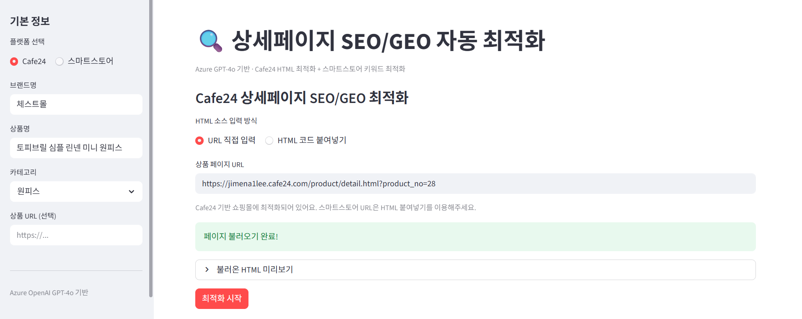
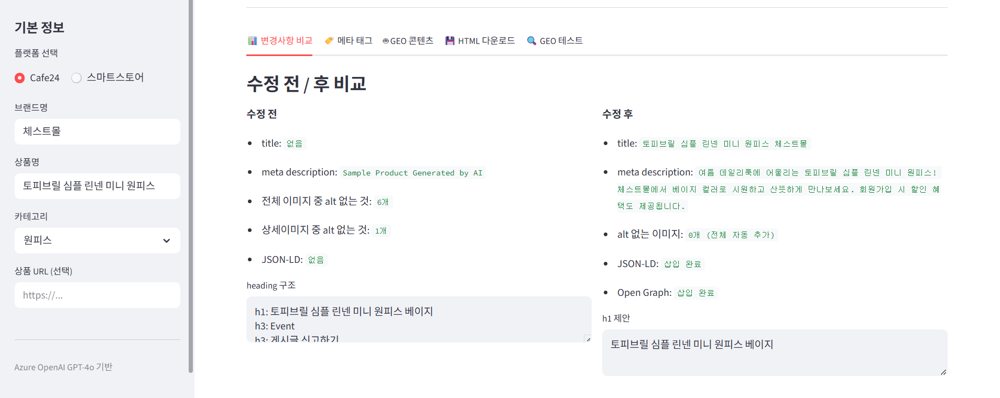
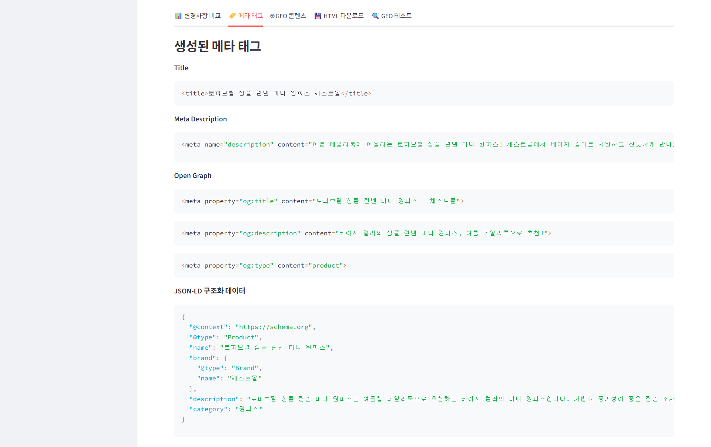
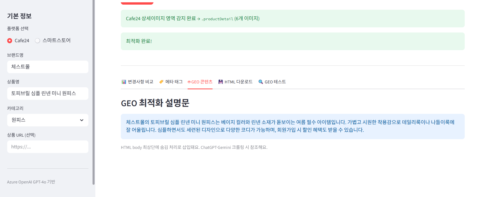
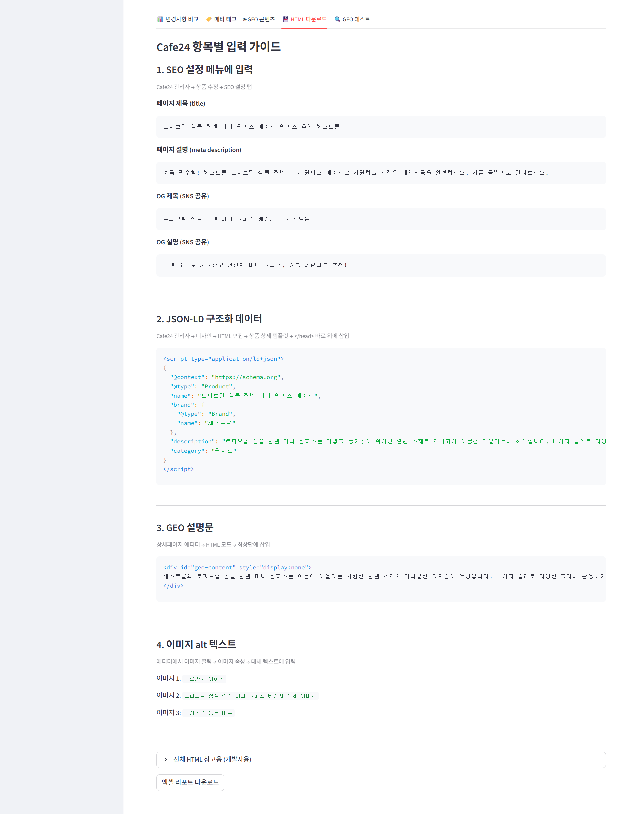
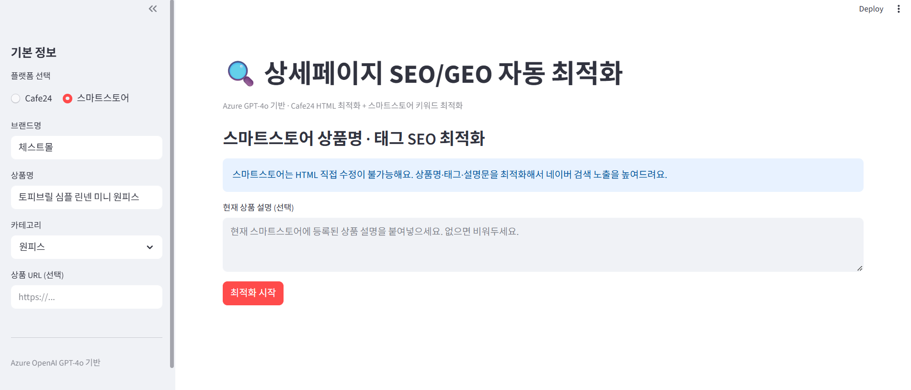
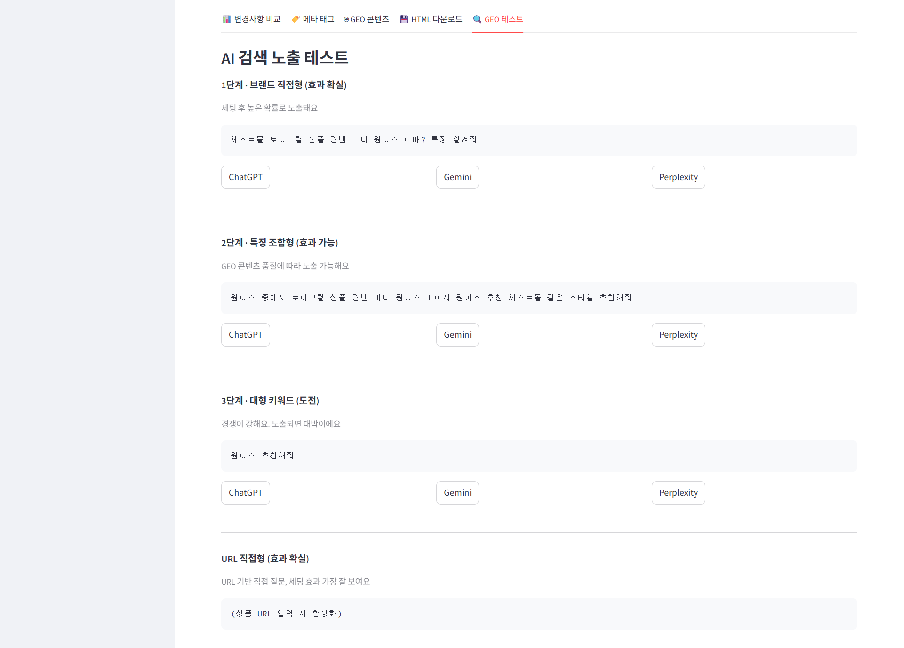

# 🔍 상세페이지 SEO/GEO 자동 최적화 도구
### E-commerce Detail Page SEO/GEO Auto-Optimization Tool

> Azure OpenAI GPT-4o 기반으로 이커머스 상세페이지 HTML을 분석하고,
> SEO(검색엔진 최적화)와 GEO(AI 검색 최적화)에 맞게 자동으로 개선하는 Streamlit 웹 앱입니다.
>
> *An AI-powered web app that analyzes e-commerce product page HTML and automatically optimizes it for both traditional SEO and GEO (Generative Engine Optimization).*

[](https://www.python.org/)
[](https://streamlit.io/)
[](https://azure.microsoft.com/ko-kr/products/ai-services/openai-service)

---

## 📌 프로젝트 배경

이커머스 셀러들은 상품 상세페이지를 제작할 때 SEO를 거의 고려하지 않습니다.
특히 Cafe24, 스마트스토어 운영자들은 이미지만 업로드하는 경우가 대부분입니다.

그 결과:
- `<title>`, `<meta description>` 누락 또는 기본값 그대로 방치
- 이미지 수십 장에 `alt` 태그 전혀 없음
- `JSON-LD` 구조화 데이터 부재로 Google 리치 스니펫 미노출
- ChatGPT, Gemini 같은 AI 검색에서 상품 정보 인식 불가 (GEO 0점)

이 프로젝트는 이 문제를 **URL 입력 또는 HTML 붙여넣기 한 번**으로 해결합니다.

---

## 🏆 프로젝트 성과
### Project Achievements

*All results below are based on actual test runs using a real Cafe24 store (체스트몰 · 토피브릴 심플 린넨 미니 원피스), not mock data.*

| 항목 | 수정 전 | 수정 후 |
|------|---------|---------|
| `<title>` | 없음 | `토피브릴 심플 린넨 미니 원피스 체스트몰` |
| `<meta description>` | `Sample Product Generated by AI` (기본값 방치) | 구매 유도 문구 포함 160자 최적화 완료 |
| alt 없는 이미지 | 6개 | 0개 (전체 자동 추가) |
| JSON-LD 구조화 데이터 | 없음 | `@type: Product` 스키마 삽입 완료 |
| Open Graph 태그 | 없음 | `og:title`, `og:description`, `og:type` 삽입 완료 |
| GEO 설명문 | 없음 | body 최상단 숨김 div 삽입 완료 |
| Cafe24 상세이미지 영역 자동 감지 | — | `.productDetail` 감지 성공 (이미지 6개) |

주요 발견 사항:
- 실제 쇼핑몰에서 meta description이 `Sample Product Generated by AI`로 수개월 방치된 사례 탐지
- 상세이미지 6개 전체에 alt 텍스트가 전혀 없는 상태를 자동 감지하고 GPT-4o로 생성
- JSON-LD 삽입 후 Google Search Console에서 구조화 데이터 인식 가능 상태로 전환

---

## ✨ 주요 기능

### Cafe24 상세페이지 HTML 최적화
| 항목 | 내용 |
|------|------|
| `<title>` 최적화 | 핵심 키워드 앞 배치, 60자 이내 |
| `<meta description>` | 구매 유도 문구 포함, 160자 이내 |
| Open Graph 태그 | 카카오톡·SNS 공유 시 썸네일·제목 자동 표시 |
| JSON-LD 구조화 데이터 | Google 리치 스니펫 + AI 검색 인식률 향상 |
| `img alt` 자동 추가 | 이미지 전체 alt 텍스트 자동 생성 |
| `h1` 태그 최적화 | 상품명 중심 heading 구조 재정리 |
| GEO 설명문 삽입 | ChatGPT·Gemini가 참조하는 자연어 콘텐츠 |

### 스마트스토어 키워드 최적화
| 항목 | 내용 |
|------|------|
| 상품명 최적화 | 네이버 검색 알고리즘에 맞는 키워드 순서 재배치 |
| 태그 10개 자동 생성 | 검색량 높은 키워드 위주 |
| 상품 설명 최적화 | 구매 유도 + 키워드 자연스럽게 포함 |
| GEO 설명문 | AI 검색 최적화용 자연어 설명 2~3문장 |

### GEO 테스트 기능
- ChatGPT · Gemini · Perplexity에서 상품 노출 여부 직접 테스트
- 브랜드 직접형 / 특징 조합형 / 대형 키워드 / URL 직접형 쿼리 자동 생성
- 세팅 전/후 스크린샷 비교 업로드

---

## 🖥️ 화면 구성

### 1. 메인 화면 — Cafe24 모드



사이드바에서 플랫폼(Cafe24 / 스마트스토어), 브랜드명, 상품명, 카테고리를 입력합니다.
HTML 소스는 URL 직접 입력 또는 붙여넣기 두 가지 방식을 지원합니다.
URL 입력 시 페이지를 자동으로 크롤링하며, Cafe24 상세이미지 영역(`.productDetail` 등)을 자동 감지합니다.

---

### 2. 최적화 결과 — 변경사항 비교 탭



수정 전 / 후를 나란히 표시합니다.
- title 없음 → `토피브릴 심플 린넨 미니 원피스 체스트몰`
- meta description `Sample Product Generated by AI` → 구매 유도 문구로 자동 교체
- alt 없는 이미지 6개 → 0개 (전체 자동 추가)
- JSON-LD, Open Graph 삽입 완료

---

### 3. 메타 태그 탭



복사해서 바로 사용할 수 있는 형태로 태그를 제공합니다.
- `<title>`, `<meta description>`, Open Graph 태그
- JSON-LD 구조화 데이터 (`@type: Product`, `brand`, `description`, `category` 포함)

---

### 4. GEO 콘텐츠 탭



ChatGPT·Gemini 크롤러가 참조하기 좋은 자연어 설명문입니다.
HTML body 최상단에 `display:none` 숨김 div로 자동 삽입됩니다.

---

### 5. Cafe24 항목별 입력 가이드 탭



Cafe24 에디터 구조에 맞춰 항목별 입력 위치를 가이드와 함께 제공합니다.
- SEO 설정 메뉴 입력값 (title, description, OG 태그)
- JSON-LD 삽입 위치 안내 (`Cafe24 관리자 → 디자인 → HTML 편집 → </head>` 위)
- GEO 설명문 (`상세페이지 에디터 → HTML 모드 → 최상단`)
- 이미지별 alt 텍스트 목록

---

### 6. 스마트스토어 모드



HTML 직접 접근 없이 텍스트 입력만으로 최적화를 진행합니다.
현재 상품 설명을 붙여넣으면 더 정확한 결과를 얻을 수 있습니다.

---

### 7. GEO 테스트 탭



최적화 후 AI 검색 노출을 직접 확인할 수 있는 쿼리를 단계별로 제공합니다.

| 단계 | 유형 | 기대 효과 |
|------|------|-----------|
| 1단계 | 브랜드 직접형 | 세팅 후 높은 확률로 노출 |
| 2단계 | 특징 조합형 | GEO 콘텐츠 품질에 따라 노출 가능 |
| 3단계 | 대형 키워드 | 경쟁 강함, 노출 시 높은 효과 |
| URL 직접형 | 상품 URL 직접 질문 | 세팅 효과 가장 직접적으로 확인 |

ChatGPT / Gemini / Perplexity 버튼 클릭 한 번으로 바로 테스트할 수 있습니다.

---

## 🤔 개발 과정에서 고민한 것들

### 1. Azure vs Google 무료 티어
초기에는 Google Cloud Vision API + Gemini 조합도 검토했습니다.
Google Gemini API가 2025년 12월에 무료 한도를 대폭 축소(50~80%)한 점,
그리고 이미 크레딧이 확보된 Azure OpenAI의 안정성을 고려해 Azure를 메인으로 결정했습니다.

### 2. 이미지 분석 → HTML 최적화로 방향 전환
초기 기획은 "포토리뷰 이미지 → 해시태그 자동 생성"이었습니다.
Azure Vision API로 이미지를 분석하고 GPT-4o로 해시태그를 생성하는 구조였습니다.

개발 과정에서 방향을 전환했습니다.
**"상세페이지 HTML 자체를 SEO/GEO에 맞게 수정하는 것"** 이
셀러 입장에서 체감 효과가 크고, 실무 적용 가능성도 높다는 판단이었습니다.
결과적으로 Azure Vision API 의존성이 제거되고 코드 구조도 단순해졌습니다.

### 3. Cafe24 vs 스마트스토어 — 플랫폼별 한계
Cafe24는 HTML을 직접 편집할 수 있어 이 앱과 잘 맞습니다.
스마트스토어는 JS 렌더링 + 봇 차단으로 URL 크롤링이 거의 불가능합니다.
이 차이를 고려해 플랫폼별로 기능을 분리했습니다.

| 플랫폼 | 입력 방식 | 주요 결과물 |
|--------|-----------|-------------|
| Cafe24 | URL 크롤링 또는 HTML 붙여넣기 | 최적화된 HTML + 항목별 입력 가이드 |
| 스마트스토어 | 상품명·설명 텍스트 입력 | 최적화된 상품명 + 태그 10개 + 설명문 |

### 4. GEO — "정말 인용되는지" 어떻게 확인하나?
GEO(Generative Engine Optimization) 효과를 측정하는 공식 API는 존재하지 않습니다.
ChatGPT, Gemini는 어떤 페이지를 참조했는지 외부에 공개하지 않습니다.

현실적인 확인 방법 3가지를 정리했습니다.
1. **Perplexity 직접 검색** — 답변 하단에 출처 URL이 명시됨
2. **Google Search Console** — GPTBot, PerplexityBot 크롤링 횟수 증가 확인
3. **AI에 직접 질문** — 브랜드명+상품명으로 ChatGPT·Gemini 검색 후 노출 여부 확인

"원피스 추천해줘" 같은 대형 키워드 노출은 HTML 세팅만으로는 한계가 있습니다.
현실적으로 효과가 나타나는 키워드 범위를 3단계로 나눠 테스트 탭에 반영했습니다.

### 5. Cafe24 HTML 다운로드의 함정
초기에는 최적화된 HTML 전체를 다운로드해서 에디터에 붙여넣도록 설계했습니다.
그러나 Cafe24 에디터는 `<body>` 안의 콘텐츠 영역만 받습니다.
`<html><head>` 구조를 에디터에 붙여넣으면 태그가 깨지거나 무시됩니다.

그래서 결과물을 **항목별로 분리**하고, 각 항목을 Cafe24 어디에 입력해야 하는지
위치 가이드와 함께 제공하는 방식으로 변경했습니다.

---

## 🛠️ 기술 스택

```
Azure OpenAI (GPT-4o)   — SEO/GEO 텍스트 생성
BeautifulSoup4          — HTML 파싱 및 태그 주입
Streamlit               — 웹 UI
Pandas + openpyxl       — 엑셀 리포트 생성
Requests                — URL 크롤링
python-dotenv           — 환경변수 관리
```

---

## 🚀 시작하기

### 1. 저장소 클론
```bash
git clone https://github.com/jimena1lee/ai-seo-geo-miniproject.git
cd ai-seo-geo-miniproject
```

### 2. 패키지 설치
```bash
pip install -r requirements.txt
```

### 3. 환경변수 설정
`.env.example`을 복사해서 `.env` 파일을 만들고 본인 Azure 정보를 입력하세요.
```bash
cp .env.example .env
```

```env
AZURE_OPENAI_ENDPOINT=https://YOUR_RESOURCE.openai.azure.com/
AZURE_OPENAI_KEY=your_openai_key_here
AZURE_OPENAI_DEPLOYMENT=gpt-4o
```

Azure OpenAI 키는 [Azure Portal](https://portal.azure.com) →
해당 리소스 → `Keys and Endpoint` 메뉴에서 확인할 수 있습니다.

### 4. 실행
```bash
streamlit run app.py
```

브라우저에서 `http://localhost:8501`로 접속하면 바로 사용할 수 있습니다.

---

## 📁 프로젝트 구조

```
ai-seo-geo-miniproject/
├── .env                  # API 키 (gitignore 처리됨)
├── .env.example          # 환경변수 템플릿
├── .gitignore
├── requirements.txt
├── config.py             # 환경변수 로딩
├── html_parser.py        # HTML 파싱 + URL 크롤링
├── seo_optimizer.py      # GPT-4o SEO/GEO 텍스트 생성
├── html_injector.py      # 최적화 결과 HTML 주입
├── app.py                # Streamlit 메인 UI
└── docs/
    └── screenshots/      # README 스크린샷
```

---

## ⚠️ 주의사항

- `.env` 파일은 절대 GitHub에 올리지 마세요 (`.gitignore`에 포함됨)
- Azure OpenAI는 사용량에 따라 과금됩니다. 테스트 시 크레딧 소진에 주의하세요
- 스마트스토어 URL 크롤링은 봇 차단으로 동작하지 않습니다. 텍스트 직접 입력 방식을 이용하세요
- GEO 효과는 크롤링 주기(수일~수주)가 있어 즉시 반영되지 않습니다

---

## 📝 라이선스

MIT License